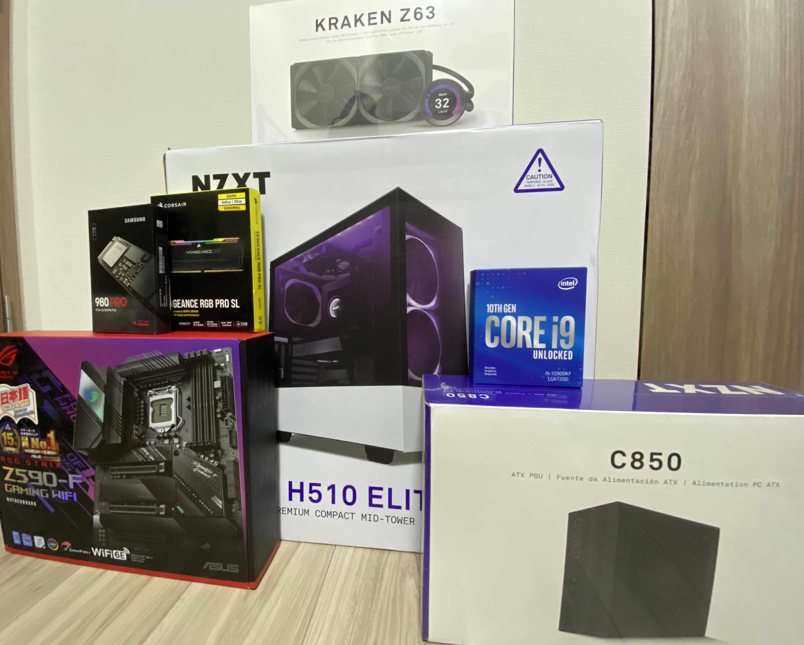

今まで一度も PC を自分で組んだことは無かったけれど、いつかはやってみたい気持ちはあった。

それを後押ししたのが、 MS による Bethesda (ZeniMax Media) の買収だった。

具体的には2022年11月11日発売予定の [Starfield](https://bethesda.net/en/game/starfield) が、噂通り PC/Xbox exclusive になることが決定してしまったから。

これを機に自分で PC を組んで、より良い環境でゲームをプレイしながらそれに備えることにした。

### 部品

組み立てに使った部品一覧は[こちら](https://pcpartpicker.com/list/k8GrkX)の pcpartpicker にまとめた。

このサイトは自分にとっては必須で、部品間の compatibility をチェックしてくれたり、他の build を参考に部品を選ぶことができる。

#### PC Case

- [NZXT H510 Elite](https://www.amazon.co.jp/gp/product/B07T7L875Z/)

他の部品も NZXT 製品が多いのと、デザイン的にも無難だったのが主な理由

#### Motherboard

- [ROG STRIX Z590-F GAMING WIFI](https://www.amazon.co.jp/gp/product/B08WJ4SJXD)

GPU を ASUS にする予定だったので、その流れでなんとなく mobo も ASUS から選んだ。

種類に関しても11世代Intelまでサポートしている位しかみていなかった。

買って気づくのは思った以上に光っていたりドラゴンなどの模様が結構書かれていること。

#### CPU

- [INTEL 第10世代CPU Comet Lake-S Corei9-10900KF](https://www.amazon.co.jp/dp/B086MG1C7D)

Intel か Ryzen かで悩んでいたが、どちらも品薄だったので GPU のボトルネックにならない程度のそれなりに高い性能であれば何でもいいと思った。

結果として満足に動いてるので全く問題ないが、もし在庫があったら第11世代にしても良かったなとは思う。

#### CPU Cooler

- [NZXT KRAKEN Z63](https://www.amazon.co.jp/gp/product/B082DYSQVF)

水冷のパフォーマンスはよく知らなかったけど、モニターが付いていたり水冷が単純にかっこよかったのでこれにした。

これの組み立てが一番難しかった。

r7kamuraさんの[PCを組んだ](https://r7kamura.com/articles/2021-01-08-pc-build-2021)にも書かれている通り（とても参考にさせてもらった）だが、

[NZXT H510 Elite](https://www.amazon.co.jp/gp/product/B07T7L875Z/) ケースに予めセットされている前面ファンを一度外して、再度ラジエーター含めて締め直さないといけない。

その際に元々繋がれていた前面ファンのケーブルも外すので、後でどこと繋がっていたかなどを思い出さないといけない。

値段も安く取り付けもしやすそうな、普通の CPU クーラーでも良かったかもしれない。 [Noctua NH-D15](https://www.amazon.co.jp/dp/B00L7UZMAK)

ただ NZXT のアプリからモニターの表示内容やケース・ファンの光具合をいじれるのはとても良い。

#### Memory

- [Corsair DDR4-3200MHz デスクトップPC用 メモリ VENGANCE RGB PRO SLシリーズ 32GB [8GB×4枚] ](https://www.amazon.co.jp/gp/product/B08SQPPLNN)

メモリにこだわり無いので、なるべく安くてレビューが極端に悪くないやつにした。

全く問題なく動いている。

常に光っている。

#### GPU(Video card)

- [ASUS ROG Strix GeForceRTX 3080 搭載 V2 OC Edition 10GB ROG-STRIX-RTX3080-O10G-V2-GAMING](https://www.amazon.co.jp/gp/product/B098324LLG)

GPU は本当に品薄で、直近まで全く買えなかったので友人から MSI の GTX 1080Ti を借りていた。

ようやく最近 Low Hash Rate 版が市場に出てきて、マイニング目的の GPU 高騰が少し落ち着いてきた感がある。

たまたまそのタイミングで上記の RTX 3080 を購入することができた。

#### SSD

- [Samsung 980 PRO 1TB](https://www.amazon.co.jp/gp/product/B08JCPTPMM)

値段は高かったけど、かなり早くて満足。

NVMe(PCIe 4 gen) で接続できる M.2

#### PSU

- [NZXT C850](https://www.amazon.co.jp/gp/product/B089536LJ1)

ケースも NZXT だったので電源もそこから選んだ。

850W は overwhelming と友人から言われたが、足りないよりはマシなのでこれにした。

### 振り返り

#### PC でプレイするゲームのすごさ

PS5でも十分すごいと思っていたけど、グラフィック、フレームレート共に全然違う。

昔のゲームでもそれらが変わるだけで見違えるし、今でも全然プレイできる。

最近のゲーム（例えば Cyberpunk 2077 とか）は本当にすごくて、PS でプレイしていたのとは違うゲームかと思うくらい。

キーボードでの操作もだんだん慣れてくる。ただ、ゲーム毎に結構配置が違うのでそこは都度覚える必要あり

#### 配線の難しさ

ケーブルマネジメントは全然上手くできなかった。

表にも結構出ているし、裏はごちゃごちゃで半ば押し込んだ形になってしまった。

ケースへのパーツの設置も、全体像をみた上で順番を考えて行うともっとスマートにできたと思う。

#### 有線マウス・キーボードが役に立った

BIOS 設定時やドライバインストール時など、どうしても有線出ないと操作できないシーンがあったので途中で安いマウスを買った。

トラブル対応時などに一つあると便利

#### 電動ドライバーが有用

今回組み立てにあたって購入して一番良かったもの

- [ベッセル(VESSEL) 電動 ボールグリップ ドライバー ビット1本付 電ドラボール 220USB-1](https://www.amazon.co.jp/gp/product/B07KSBSK4Z)

初めてだったのでつけ間違えや、順番的に意図した位置に設置できなくなって一度外すときなど結構萎えるんだけど、そういう時にシュッと外せるのは偉大

micro USB だけど充電できるのもとても助かっている

#### Mac 環境での Windows ISO の作成

Mac での作成に関しては以下の Qiita に助けられた

`install.wim` というファイルが大きいので、FAT 32フォーマットで書き込むために分割する必要がある

https://qiita.com/sohsatoh/items/9fe0dcdc084ef9f7cbf8

