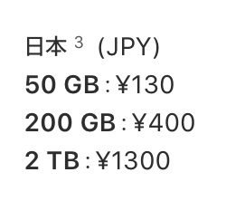
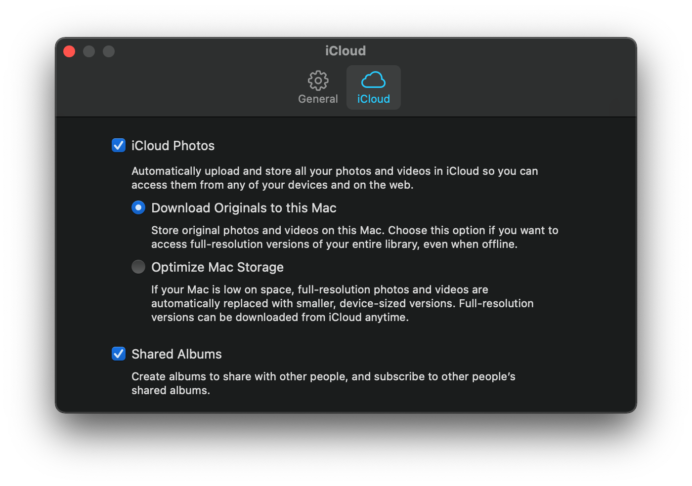
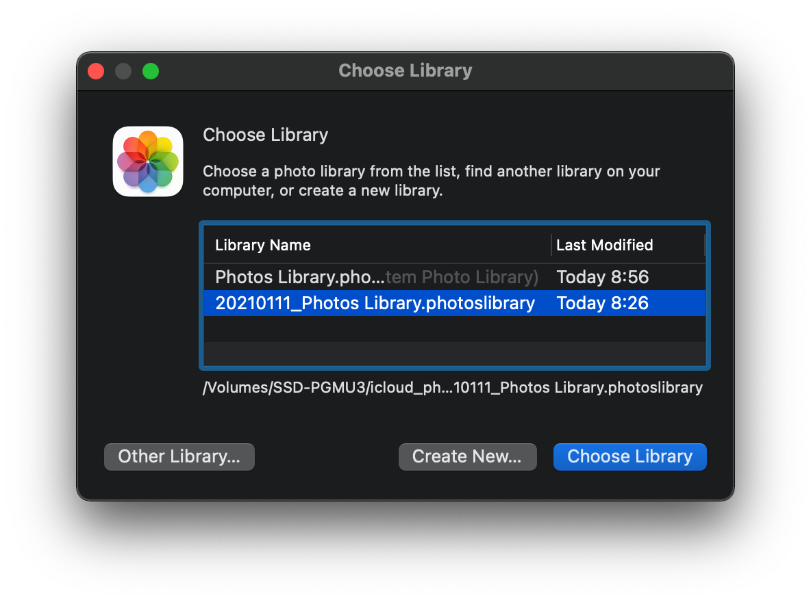

iCloud が登場してから、ずっと iPhone + iCloud のみで写真を管理してきている。
家族もファミリープランに登録しており、以下の　200GB　のプランを使ってた。

https://support.apple.com/ja-jp/HT201238

しかし子供が産まれてから写真を取る頻度や枚数がとても増えて、契約していた 200GB プランの上限が見えてきてしまった。
面倒なので更に上の　2TB　プランを契約しようかとも考えたが、今後も考えると　2TB でもあまり長続きもしなさそうと思い、これを機会に考えることにした。
このブログでは実際に決定した運用方針を説明する。

## 選定サービス

信頼性とコストの面も考えて、いくつかの対象に分けて保存することにした。

- 1. [Amazon Photos](https://www.amazon.co.jp/b?ie=UTF8&node=5262648051)
- 2. iCloud
- 3. Google Photos
- 4. Time Machine
- 5. HDD

大きくクラウド3つとローカル2つに分かれる。
全部で5つと対象が多くなってしまったのがやや課題だが、ローカルの2つに関しては元から運用していた。

### 1. [Amazon Photos](https://www.amazon.co.jp/b?ie=UTF8&node=5262648051)

以前から Amazon Prime 会員ではあるので、メインのクラウドバックアップ先になった。

Amazon Photos の特徴は主に以下

- Amazon Prime 会員だと写真に関しては無制限アップロードかつ品質も元のままでアップロードが可能
- Family Vault という概念があり、会員は5名まで招待できて招待されたユーザも招待者と同じ無制限アップロードが与えられる
- 無制限は写真のみで、動画は Amazon Prime 会員であっても 5GB　まで
- Mac 版アプリが配布されているので、スマートフォンでポチポチやる必要無し

また心理的な面でも、既に Amazon Prime で年会費は払っているので急な有料化などは起こりづらいのではという仮説があり、
自分の場合は他の無料サービスと比較して安心して決定できた。

### 2. iCloud

引き続き 200GB プランを継続して使用する。
50GB に下げることも可能だが、後述する実運用でバックアップを行うインターバルが短くなって面倒なのと、
現在の値段だと対してどちらも変わらないため。

iCloud は写真と動画それぞれどちらも劣化なしで元ファイルを保持してくれるので、一時キャッシュとして扱うことにした。

### Google Photo

既に2021年6月1日からのストレージ有料化が発表されているので、メインのバックアップ先としては検討できなかった。

https://photos.google.com/u/0/storagepolicy?hl=ja\

ただ現状は無料なので、サブの保存先としてとりあえずあげている。
万が一何かが消えた時などにもしかしたらここにあるかも？と探せれば良いかな程度の温度感。

### Time Machine

以前から Mac で Time Machine を使ってバックアップを取っていた。
その場合自動的に Photos.app がみている `Photos Library.photoslibrary` がバックアップされている。

https://support.apple.com/ja-jp/guide/photos/pht6d60d10f/mac

念の為ダウンロードする写真をオリジナルに設定している。

### HDD

上記の Time Machine とは別の HDD/SSD を使って、 `Photos Library.photoslibrary` のハードコピーを保存する。

## 実運用

### 年一回行うバックアップ

- iCloud にある写真と動画を全て Mac にダウンロードする
  - その `Photos Library.photoslibrary` を HDD にハードコピーする
  - [Amazon Photos](https://www.amazon.co.jp/b?ie=UTF8&node=5262648051) に取った写真を全てあげ、家族間で共有したい写真を Family Vault にいれる
  - Time Machine のマニュアルバックアップを実行する
    - 中身を確認する
- iCloud から写真と動画を削除する

### その他

- 家族間でスポットで共有したい写真や動画は[みてね](https://mitene.us)を使う
- ハードコピーしたバックアップ対象の `Photos Library.photoslibrary` をたまにみたい場合、option キーを押しながら Photos.app を起動すると任意のファイルが選べる
  - https://support.apple.com/en-lamr/HT201517

## まとめ

2020年のバックアップはこれで完了した。
NAS を使うなど他の選択肢も考えたが、時間などの制約もあって今回は見送った。
来年以降も見直してアップデートしていけるといい。