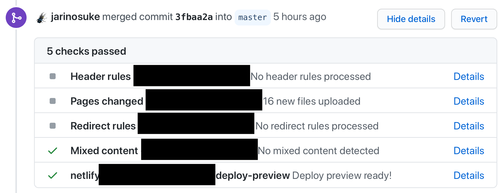

### 動機

最近 blog 書く頻度また減ってきた。

それと同時にもう少しカジュアルに書きたい・書けるようにしたいというモチベーションが出てきて

これを機会に blog の移設をしようと思った。

今までは[はてなブログ](https://jarinosuke.hatenablog.com)で書いていたけれど、以下のような点で億劫になってきていた。

- Markdown で書けるには書けるが、画像のアップロードなどでなんやかんや結構 CMS というか Web UI を触らなければならない
  - **ローカルのエディタで編集は完結していて、あとは push したらシュッと色々やられてデプロイされるのが望ましい**
- はてなブログ Pro の値段が高い / その価格に対して恩恵を得られていない（ブログを書いていないのが大きいのかもしれない…）
- 界隈のコミュニティ

今までの記事全てを export するのも面倒だなと思ったので、2020 年に書いた 3 つの記事だけ手作業で移した。

### Gatsby

Gatsby を選んだ動機は ishkawa さんの記事 [ブログをGatsbyで再構築した | ishkawa](https://ishkawa.org/1584277737/) を見て良さそうと思ったから。

CSS など特に参考にさせてもらった。

Jekyll の延長線くらいの理解で、ちゃんと理解しないまま Gatsby を使い始めたけど、 [Reactベース静的サイトジェネレータGatsbyの真の力をお見せします](https://qiita.com/uehaj/items/1b7f0a86596353587466) を読んで結構違うよう。

GraphQL を使って、ビルド時にあれこれできるのは面白いなと思った。

### Netlify

デプロイ + ホスティングには GitHub Actions + Pages は使っていなくて、 Netlify で完結している。

ポチポチやるだけで GitHub とのインテグレーションが完結して、なんなら Pull Request を作成するたびに `gatsby build` が走ってデプロイ予定の Preview のビルドまでしてくれる。

他に凝った使い方はあまりしていない。

カスタムドメイン blog.jarinosuke.com を使いたかったので、Netlify DNS を使っている。

払い出された Netlify のネームサーバを自分の取得したドメイン（自分の場合はお名前.com）に設定することで動いた。

Analytics や branch 毎に A/B Testing できる機能もあるみたいだけど、今の所これで十分

### 移行後の改善点

この記事を書いてみて、以前と変わって良くなったことは以下

- ローカルのエディタ VSCode で Vim を使いながら書くことができる
- 画像も D&D で追加することができ、いちいちブラウザを開く必要がない

Gatsby / GraphQL など知らなかった技術に触れたのも良い機会だったと思う。まだ全然理解してないけれど…

### 残課題

まだ未着手の実装などは以下

- ✅ダークモード対応 [ダークモード対応した](../dark-mode)
- RSS 対応
- tagging
- デザインおかしいところ修正

### 参考

- [ブログをGatsbyで再構築した | ishkawa](https://ishkawa.org/1584277737/)
- [Reactベース静的サイトジェネレータGatsbyの真の力をお見せします](https://qiita.com/uehaj/items/1b7f0a86596353587466)
- [Github ActionsでNetlifyに自動デプロイする](https://medium.com/@kosa3/github-actionsでnetlifyに自動デプロイする-22ac30e02528)
- [お名前.comで取得したドメインを、Netlify に設定する方法｜Koushi Kagawa｜note](https://note.com/koushikagawa/n/n407cde93bdca)